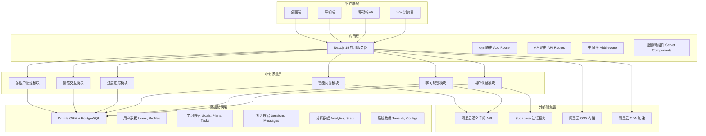
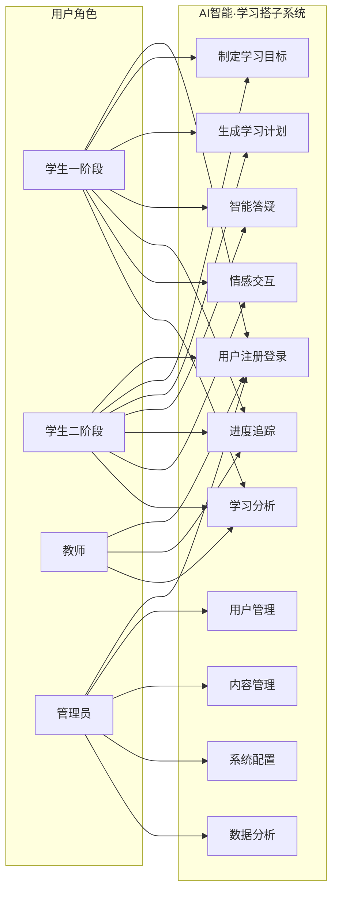
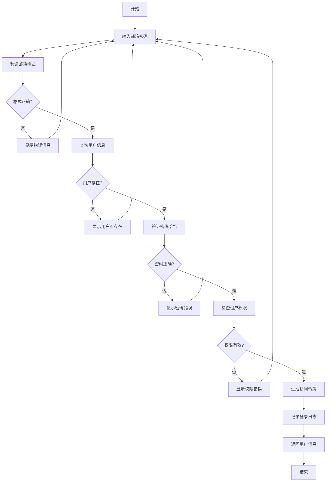
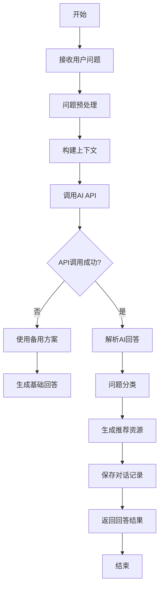
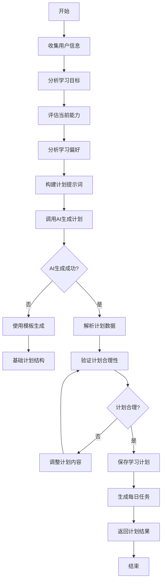
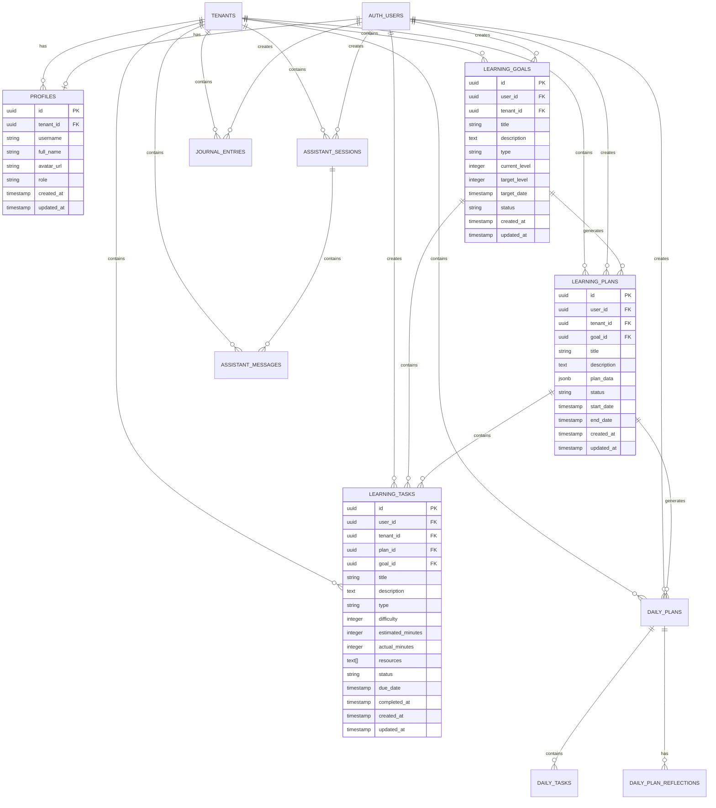
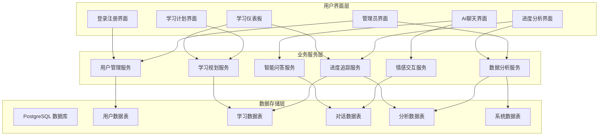
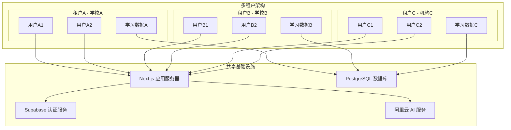
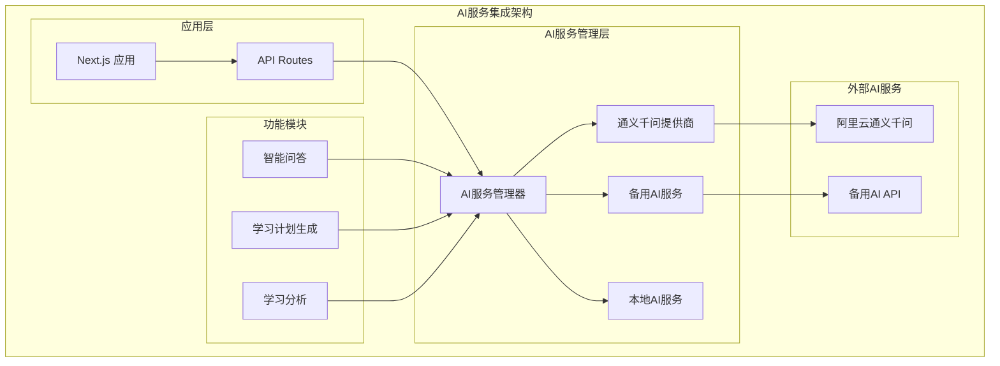
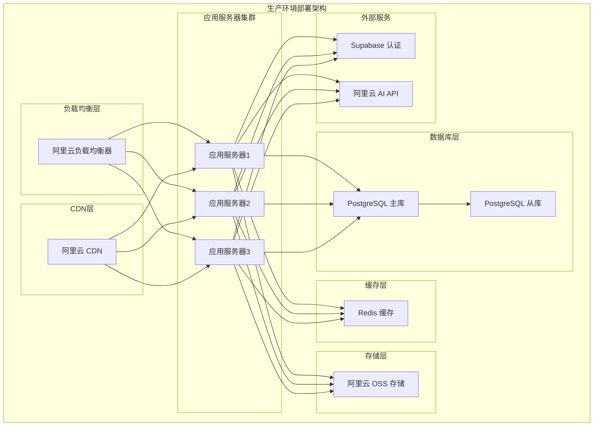

# 《AI智能·学习搭子》系统架构图与流程图

## 1. 系统整体架构图

```mermaid
graph TB
    subgraph "客户端层"
        A[Web浏览器] 
        B[移动端H5]
        C[平板端]
        D[桌面端]
    end
    
    subgraph "应用层"
        E[Next.js 15 应用服务器]
        E1[页面路由 App Router]
        E2[API路由 API Routes]
        E3[中间件 Middleware]
        E4[服务端组件 Server Components]
    end
    
    subgraph "业务逻辑层"
        F1[用户认证模块]
        F2[学习规划模块]
        F3[智能问答模块]
        F4[进度追踪模块]
        F5[情感交互模块]
        F6[多租户管理模块]
    end
    
    subgraph "数据访问层"
        G[Drizzle ORM + PostgreSQL]
        G1[用户数据 Users, Profiles]
        G2[学习数据 Goals, Plans, Tasks]
        G3[对话数据 Sessions, Messages]
        G4[分析数据 Analytics, Stats]
        G5[系统数据 Tenants, Configs]
    end
    
    subgraph "外部服务层"
        H1[阿里云通义千问 API]
        H2[Supabase 认证服务]
        H3[阿里云 OSS 存储]
        H4[阿里云 CDN 加速]
    end
    
    A --> E
    B --> E
    C --> E
    D --> E
    
    E --> F1
    E --> F2
    E --> F3
    E --> F4
    E --> F5
    E --> F6
    
    F1 --> G
    F2 --> G
    F3 --> G
    F4 --> G
    F5 --> G
    F6 --> G
    
    F2 --> H1
    F3 --> H1
    F1 --> H2
    E --> H3
    E --> H4
```

## 2. 系统用例图

```mermaid
graph LR
    subgraph "AI智能·学习搭子系统"
        UC1[用户注册登录]
        UC2[制定学习目标]
        UC3[生成学习计划]
        UC4[智能答疑]
        UC5[进度追踪]
        UC6[情感交互]
        UC7[学习分析]
        UC8[用户管理]
        UC9[内容管理]
        UC10[系统配置]
        UC11[数据分析]
    end
    
    subgraph "用户角色"
        U1[学生一阶段]
        U2[学生二阶段]
        U3[教师]
        U4[管理员]
    end
    
    U1 --> UC1
    U1 --> UC2
    U1 --> UC3
    U1 --> UC4
    U1 --> UC5
    U1 --> UC6
    U1 --> UC7
    
    U2 --> UC1
    U2 --> UC2
    U2 --> UC3
    U2 --> UC4
    U2 --> UC5
    U2 --> UC6
    U2 --> UC7
    
    U3 --> UC1
    U3 --> UC5
    U3 --> UC7
    
    U4 --> UC1
    U4 --> UC8
    U4 --> UC9
    U4 --> UC10
    U4 --> UC11
```

## 3. 用户登录流程图

```mermaid
flowchart TD
    A[开始] --> B[输入邮箱密码]
    B --> C[验证邮箱格式]
    C --> D{格式正确?}
    D -->|否| E[显示错误信息]
    E --> B
    D -->|是| F[查询用户信息]
    F --> G{用户存在?}
    G -->|否| H[显示用户不存在]
    H --> B
    G -->|是| I[验证密码哈希]
    I --> J{密码正确?}
    J -->|否| K[显示密码错误]
    K --> B
    J -->|是| L[检查租户权限]
    L --> M{权限有效?}
    M -->|否| N[显示权限错误]
    N --> B
    M -->|是| O[生成访问令牌]
    O --> P[记录登录日志]
    P --> Q[返回用户信息]
    Q --> R[结束]
```

## 4. 智能问答流程图

```mermaid
flowchart TD
    A[开始] --> B[接收用户问题]
    B --> C[问题预处理]
    C --> D[构建上下文]
    D --> E[调用AI API]
    E --> F{API调用成功?}
    F -->|否| G[使用备用方案]
    G --> H[生成基础回答]
    F -->|是| I[解析AI回答]
    I --> J[问题分类]
    J --> K[生成推荐资源]
    K --> L[保存对话记录]
    L --> M[返回回答结果]
    M --> N[结束]
```

## 5. 学习计划生成流程图

```mermaid
flowchart TD
    A[开始] --> B[收集用户信息]
    B --> C[分析学习目标]
    C --> D[评估当前能力]
    D --> E[分析学习偏好]
    E --> F[构建计划提示词]
    F --> G[调用AI生成计划]
    G --> H{AI生成成功?}
    H -->|否| I[使用模板生成]
    I --> J[基础计划结构]
    H -->|是| K[解析计划数据]
    K --> L[验证计划合理性]
    L --> M{计划合理?}
    M -->|否| N[调整计划内容]
    N --> L
    M -->|是| O[保存学习计划]
    O --> P[生成每日任务]
    P --> Q[返回计划结果]
    Q --> R[结束]
```

## 6. 数据库关系图

```mermaid
erDiagram
    TENANTS ||--o{ PROFILES : "has"
    TENANTS ||--o{ LEARNING_GOALS : "contains"
    TENANTS ||--o{ LEARNING_PLANS : "contains"
    TENANTS ||--o{ LEARNING_TASKS : "contains"
    TENANTS ||--o{ DAILY_PLANS : "contains"
    TENANTS ||--o{ ASSISTANT_SESSIONS : "contains"
    TENANTS ||--o{ ASSISTANT_MESSAGES : "contains"
    TENANTS ||--o{ JOURNAL_ENTRIES : "contains"
    
    AUTH_USERS ||--o| PROFILES : "has"
    AUTH_USERS ||--o{ LEARNING_GOALS : "creates"
    AUTH_USERS ||--o{ LEARNING_PLANS : "creates"
    AUTH_USERS ||--o{ LEARNING_TASKS : "creates"
    AUTH_USERS ||--o{ DAILY_PLANS : "creates"
    AUTH_USERS ||--o{ ASSISTANT_SESSIONS : "creates"
    AUTH_USERS ||--o{ JOURNAL_ENTRIES : "creates"
    
    LEARNING_GOALS ||--o{ LEARNING_PLANS : "generates"
    LEARNING_GOALS ||--o{ LEARNING_TASKS : "contains"
    
    LEARNING_PLANS ||--o{ LEARNING_TASKS : "contains"
    LEARNING_PLANS ||--o{ DAILY_PLANS : "generates"
    
    DAILY_PLANS ||--o{ DAILY_TASKS : "contains"
    DAILY_PLANS ||--o{ DAILY_PLAN_REFLECTIONS : "has"
    
    ASSISTANT_SESSIONS ||--o{ ASSISTANT_MESSAGES : "contains"
    
    PROFILES {
        uuid id PK
        uuid tenant_id FK
        string username
        string full_name
        string avatar_url
        string role
        timestamp created_at
        timestamp updated_at
    }
    
    LEARNING_GOALS {
        uuid id PK
        uuid user_id FK
        uuid tenant_id FK
        string title
        text description
        string type
        integer current_level
        integer target_level
        timestamp target_date
        string status
        timestamp created_at
        timestamp updated_at
    }
    
    LEARNING_PLANS {
        uuid id PK
        uuid user_id FK
        uuid tenant_id FK
        uuid goal_id FK
        string title
        text description
        jsonb plan_data
        string status
        timestamp start_date
        timestamp end_date
        timestamp created_at
        timestamp updated_at
    }
    
    LEARNING_TASKS {
        uuid id PK
        uuid user_id FK
        uuid tenant_id FK
        uuid plan_id FK
        uuid goal_id FK
        string title
        text description
        string type
        integer difficulty
        integer estimated_minutes
        integer actual_minutes
        text[] resources
        string status
        timestamp due_date
        timestamp completed_at
        timestamp created_at
        timestamp updated_at
    }
```

## 7. 系统功能模块图

```mermaid
graph TB
    subgraph "用户界面层"
        UI1[登录注册界面]
        UI2[学习仪表板]
        UI3[AI聊天界面]
        UI4[学习计划界面]
        UI5[进度分析界面]
        UI6[管理员界面]
    end
    
    subgraph "业务服务层"
        SVC1[用户管理服务]
        SVC2[学习规划服务]
        SVC3[智能问答服务]
        SVC4[进度追踪服务]
        SVC5[情感交互服务]
        SVC6[数据分析服务]
    end
    
    subgraph "数据存储层"
        DB1[PostgreSQL 数据库]
        DB2[用户数据表]
        DB3[学习数据表]
        DB4[对话数据表]
        DB5[分析数据表]
        DB6[系统数据表]
    end
    
    UI1 --> SVC1
    UI2 --> SVC2
    UI2 --> SVC4
    UI3 --> SVC3
    UI3 --> SVC5
    UI4 --> SVC2
    UI5 --> SVC4
    UI5 --> SVC6
    UI6 --> SVC1
    UI6 --> SVC6
    
    SVC1 --> DB2
    SVC2 --> DB3
    SVC3 --> DB4
    SVC4 --> DB3
    SVC4 --> DB5
    SVC5 --> DB4
    SVC6 --> DB5
    SVC6 --> DB6
```

## 8. 多租户数据隔离架构图

```mermaid
graph TB
    subgraph "多租户架构"
        subgraph "租户A - 学校A"
            TA1[用户A1]
            TA2[用户A2]
            TA3[学习数据A]
        end
        
        subgraph "租户B - 学校B"
            TB1[用户B1]
            TB2[用户B2]
            TB3[学习数据B]
        end
        
        subgraph "租户C - 机构C"
            TC1[用户C1]
            TC2[用户C2]
            TC3[学习数据C]
        end
    end
    
    subgraph "共享基础设施"
        INFRA1[Next.js 应用服务器]
        INFRA2[PostgreSQL 数据库]
        INFRA3[Supabase 认证服务]
        INFRA4[阿里云 AI 服务]
    end
    
    TA1 --> INFRA1
    TA2 --> INFRA1
    TA3 --> INFRA2
    
    TB1 --> INFRA1
    TB2 --> INFRA1
    TB3 --> INFRA2
    
    TC1 --> INFRA1
    TC2 --> INFRA1
    TC3 --> INFRA2
    
    INFRA1 --> INFRA3
    INFRA1 --> INFRA4
```

## 9. AI服务集成架构图

```mermaid
graph TB
    subgraph "AI服务集成架构"
        subgraph "应用层"
            APP[Next.js 应用]
            API[API Routes]
        end
        
        subgraph "AI服务管理层"
            MANAGER[AI服务管理器]
            PROVIDER1[通义千问提供商]
            PROVIDER2[备用AI服务]
            FALLBACK[本地AI服务]
        end
        
        subgraph "外部AI服务"
            QIANWEN[阿里云通义千问]
            BACKUP[备用AI API]
        end
        
        subgraph "功能模块"
            CHAT[智能问答]
            PLAN[学习计划生成]
            ANALYSIS[学习分析]
        end
    end
    
    APP --> API
    API --> MANAGER
    MANAGER --> PROVIDER1
    MANAGER --> PROVIDER2
    MANAGER --> FALLBACK
    
    PROVIDER1 --> QIANWEN
    PROVIDER2 --> BACKUP
    
    CHAT --> MANAGER
    PLAN --> MANAGER
    ANALYSIS --> MANAGER
```

## 10. 系统部署架构图

```mermaid
graph TB
    subgraph "生产环境部署架构"
        subgraph "负载均衡层"
            LB[阿里云负载均衡器]
        end
        
        subgraph "应用服务器集群"
            APP1[应用服务器1]
            APP2[应用服务器2]
            APP3[应用服务器3]
        end
        
        subgraph "数据库层"
            DB[PostgreSQL 主库]
            DB_SLAVE[PostgreSQL 从库]
        end
        
        subgraph "缓存层"
            REDIS[Redis 缓存]
        end
        
        subgraph "存储层"
            OSS[阿里云 OSS 存储]
        end
        
        subgraph "CDN层"
            CDN[阿里云 CDN]
        end
        
        subgraph "外部服务"
            SUPABASE[Supabase 认证]
            AI_API[阿里云 AI API]
        end
    end
    
    LB --> APP1
    LB --> APP2
    LB --> APP3
    
    APP1 --> DB
    APP2 --> DB
    APP3 --> DB
    
    DB --> DB_SLAVE
    
    APP1 --> REDIS
    APP2 --> REDIS
    APP3 --> REDIS
    
    APP1 --> OSS
    APP2 --> OSS
    APP3 --> OSS
    
    CDN --> APP1
    CDN --> APP2
    CDN --> APP3
    
    APP1 --> SUPABASE
    APP2 --> SUPABASE
    APP3 --> SUPABASE
    
    APP1 --> AI_API
    APP2 --> AI_API
    APP3 --> AI_API
```
